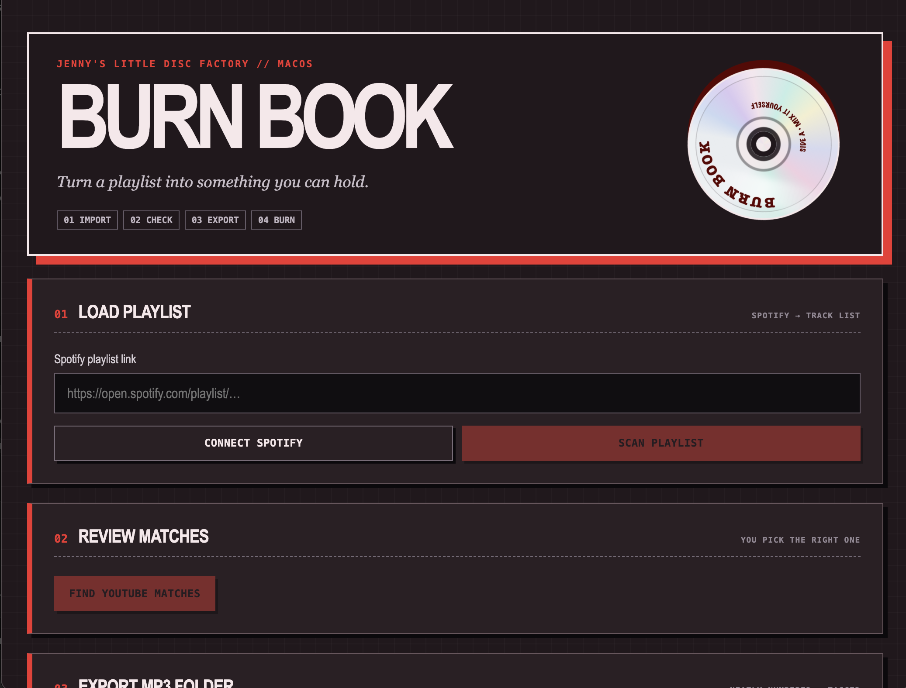

# Burn Book

Burn Book is a macOS desktop workflow for turning a Spotify playlist into an organized, reviewed audio-CD project. It imports playlist metadata, finds multiple media candidates for every track, lets the user approve the correct matches, exports numbered MP3 files, checks the running time, and controls a compatible optical drive through macOS.

> **Status:** active prototype. Playlist import, match review, MP3 export, disc inspection, capacity validation, and native burn commands are implemented. Optical-drive behaviour depends on the connected hardware and macOS support.

## Preview


## Why I built it

Making a mix CD currently means bouncing between a streaming playlist, searches, conversion tools, folders, metadata editors, and a separate burning application. Burn Book brings those steps into one explicit workflow while keeping the user in control of every media match.

## Features

- Spotify OAuth and playlist import with pagination
- Multiple search candidates for each track with manual approval or skipping
- Numbered MP3 export with metadata and artwork
- Configurable output folders and playlist-safe filenames
- Audio-CD duration and track-order inspection
- Optical-drive and writable-media detection on macOS
- Burn speed, inter-track pause, and post-burn eject settings
- Process monitoring and DiscRecording log validation to avoid false success messages
- Cleanup and per-track error reporting when an export fails

## Tech stack

- TypeScript, React, Vite, Electron
- Spotify Web API
- `yt-dlp`, `ffmpeg`, and `ffprobe`
- Native macOS `drutil` and DiscRecording logs

## Run locally

### Prerequisites

- Node.js and npm
- macOS for the disc-burning workflow
- [`yt-dlp`](https://github.com/yt-dlp/yt-dlp)
- [`ffmpeg`](https://ffmpeg.org/)
- A Spotify developer application

Install the command-line dependencies with Homebrew:

```bash
brew install yt-dlp ffmpeg
```

Copy the example environment file and add your own Spotify credentials:

```bash
cp .env.example .env
```

Configure `http://127.0.0.1:8888/callback` as a redirect URI in the Spotify developer dashboard, then install and launch the app:

```bash
npm install
npm run dev
```

## Build

```bash
npm run build
```

Generated builds are written to `release/` and are intentionally excluded from version control.

## How it is organized

- [`src/App.tsx`](src/App.tsx) contains the renderer workflow and state.
- [`electron/main.ts`](electron/main.ts) owns OAuth, filesystem access, external processes, media inspection, and disc burning.
- [`electron/preload.ts`](electron/preload.ts) exposes the Electron bridge to React.
- [`ARCHITECTURE.md`](ARCHITECTURE.md) describes how the renderer and main process communicate.
- [`DECISIONS.md`](DECISIONS.md) records important implementation choices and tradeoffs.

## Responsible use

Burn Book is intended for audio the user owns or has permission to process. It does not bypass DRM or copy protected streaming audio. Users review and authorize external media sources themselves.

## Known limitation

The current disc workflow uses macOS-only system utilities. Direct burning therefore requires macOS and a drive recognized by DiscRecording. Other platforms can still use the playlist review and folder-export portions after platform-specific dependency paths are configured.

## License

[MIT](LICENSE)
